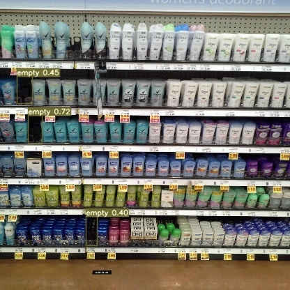
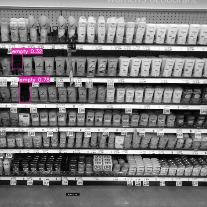

# ESD (Empty Space Detection)

This repository is part of the project where empty spaces in retail environments can be detected using machine learning model. Yolov7 has been used to train and detect the empty spaces. For dataset, a smaller version of SKU-110k has been used. All the images in our dataset has been labelled using LabelImg tool. Due to the small size of our labelled dataset we have applied some data augmentation techniques to increase the data in our train set. We have achieved 76.1%mAP@.5 from our small dataset.

## Dataset

The SKU-110K dataset collects 11,762 densely packed shelf images from thousands of supermarkets around the world. We have used a subset of this dataset. Our dataset includes a total of 628 images with validation set. For test we have used 50 images that are not in the training or validation set.

## Data Labeling and Augmentation

For labeling we have used LabelImg. Our dataset only contains one class that is "empty". We have applied multiple augmentation techniques for example: flipping image on Y-axis, grayscale conversion, image rotation etc.

### A sample labelled image using LabelImg Tool

### Types of images excluded from the dataset

### Types of images included in our dataset

### Some information about Empty spaces in our dataset

## Data Augmentation

### Gray scale conversion, 90, 180, 270 degree rotation and flip on Y-axis

## Training

Batch size used in training : 8,16,32
Epochs in training : 75, 150, 200

## Result

### Results from our well performing models

### Some detection images

